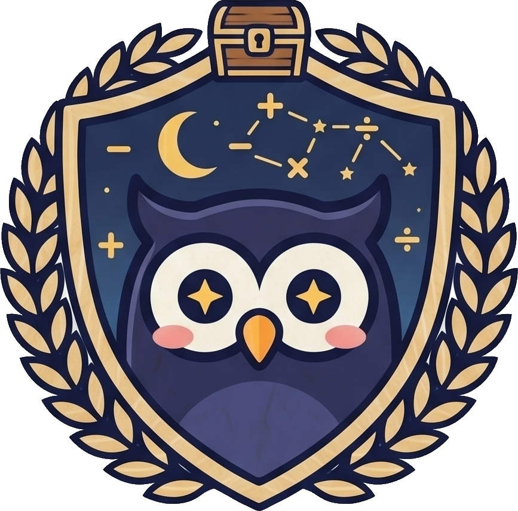

<!--
  This is the SOURCE of the PUBLIC repo's README. seed-public.mjs copies it to the
  discovery-quest repo as README.md. (The private monorepo keeps its own README.md.)
  Hero = the Discovery Quest brand crest (Luna the owl + treasure chest), assets/hero.png.
-->
<p align="center">
  
</p>

<h1 align="center">Discovery Quest</h1>
<p align="center"><em>An open learning engine — and a course format anyone can contribute to.</em></p>

Discovery Quest is a quest-based learning platform for young kids (Luna's Math Quest, English
Quest, …). This repository is its **open core**: the engine, the **course format**, the validator,
and the official courses. The hosted apps, accounts, audio, and AI tooling are the commercial
product built on top — but everything you need to **author and validate a course lives here**.

> **Open source (AGPL-3.0), open-core business.** The engine is free to use, study, modify, and
> self-host — by schools, homeschoolers, and businesses alike. Hosting, AI generation, and premium
> content are the commercial product. See [Licensing](#licensing).

## The idea: courses are data, not code

The system splits cleanly into a **fixed engine vocabulary** (code) and **course content** (data):

- **Engine (code):** *board kinds* (interactive question UIs + their generators), *view kinds*
  (lesson visuals), the lesson player, scoring, the companion, audio playback.
- **Course (data — what you contribute):** worlds → stations, "Learn it" lessons (beats), the
  word banks / sentences a board uses, and the narration text. **You compose existing boards and
  views and supply data — no engine code.**

A new *interaction* is the only thing that needs an engine change. Everything else is a YAML PR
that an AI can draft and `course:check` can validate.

## What's in here

```
packages/
  engine            save / spaced-review / sync / telemetry  (headless core)
  engine-ui         companion (LunaOwl) + lesson player
  voice-kit         audio + music playback
  quest-runtime     scoring / progression
  math, english     the official course libraries (boards, views, lessons, curriculum, content)
scripts/            the course-format toolchain (below)
docs/specs/         the format spec + lesson formats
docs/specs/course-format/{math,english}.course.yml   ← the live courses, in the format
```

## Quickstart — validate a course

```bash
npm install
npm run course:check -- docs/specs/course-format/english.course.yml --app packages/english
```

`course:check` runs two layers:
- **Structural** — a JSON Schema (`packages/<subject>/course.schema.json`, generated from the
  engine's capability catalog) checks the course shape, that every `board`/`view.kind` is real,
  and that each view's props are the right type. This is also the schema to hand an LLM for
  reliable course generation.
- **Semantic** — every spoken line has matching on-screen text, references resolve, and (with
  `--voice`) every narration line has fresh audio.

Other commands: `npm run course:capabilities` (regenerate the catalog of boards/views/content),
`npm run course:schema` (regenerate the JSON Schema), `npm run validate` (freshness gates),
`npm run course:changelog` (regenerate each course's `<id>.changelog.json` from the git history
of its `<id>.course.yml` — this feeds the per-course **Update Log** shown on discoveryquest.app;
after authoring changes, run it and mirror the JSON into the platform repo alongside the YAML).

## Contributing a course

You can add a world, a station, a lesson, or word lists **as data** — see
**[CONTRIBUTING.md](CONTRIBUTING.md)**. The capability catalog
(`packages/<subject>/engine.capabilities.json`) lists every board and view with its description
and fields — the menu you compose from (and the perfect context for an AI to generate a course).
A brand-new interaction is a separate engine PR.

Because this is a product for young children, **contribution is open but merge is gated**:
maintainers review every submission for pedagogy, accuracy, and age-appropriateness.

## Licensing

Open source, open-core — WordPress/GitLab style. The engine is open; the business is hosting,
AI generation, and premium content.

- **Engine code** (`packages/*`, `scripts/*`): **AGPL-3.0** — free to use, modify, and self-host;
  run a *modified* network service and you publish your changes. See [LICENSE](LICENSE). A
  **commercial (non-AGPL) license** is available — **hello@discoveryquest.app**.
- **Course content** (the `*.course.yml`, lessons, narration text, word banks): **CC BY-SA 4.0** —
  free for schools and anyone to use and adapt, with attribution + share-alike.
- **Your contributions:** by submitting you agree to the contributor terms in
  [LICENSING.md](LICENSING.md) — you keep copyright; your work ships publicly under the open license
  above, and you grant Discovery Quest a broad license (including commercial use in the hosted
  product). CLA details there.

*(License terms are pending final legal review before the first public release.)*

## Status

The format, validator, and capability catalog are stable and validate both live courses today.
A `courses/` loader + a reference runner (so a contributed course can be previewed/played without
the private apps) are on the roadmap. 🦉

## Contact

Questions, commercial licensing, or security reports: **hello@discoveryquest.app**.
